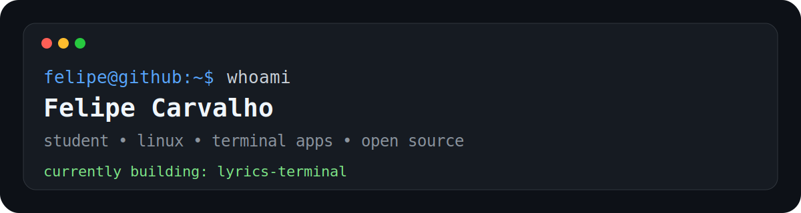

## About Me

I'm Felipe, a student at Germinare Tech from Brazil.

I enjoy Linux, terminal applications, open source software and building projects that start as small ideas and somehow become much bigger than expected.

## What I'm Doing

* Maintaining and improving **lyrics-terminal**
* Learning **Java** and **PostgreSQL**
* Exploring Linux, CLI tools and automation
* Breaking and fixing my Linux installation on a regular basis
* Learning software development through real projects

## Featured Project

### lyrics-terminal

A Linux terminal application that displays synchronized Spotify lyrics directly inside the terminal.

My first serious open source project.

Repository:

https://github.com/Felipx423/lyrics-terminal

## Currently Learning

* Java
* PostgreSQL
* HTML
* CSS
* JavaScript
* Git
* Linux internals

## Tools I Use

  
  
  
  
  
  
  
  
  

## GitHub Activity

<picture>
  <source media="(prefers-color-scheme: dark)" srcset="https://raw.githubusercontent.com/Felipx423/Felipx423/snake-output/github-contribution-grid-snake-dark.svg">
  <source media="(prefers-color-scheme: light)" srcset="https://raw.githubusercontent.com/Felipx423/Felipx423/snake-output/github-contribution-grid-snake.svg">
  
</picture>

## Goals for 2026

* Improve lyrics-terminal
* Publish more projects
* Contribute to open source
* Understand the code I write instead of just making it work
* Become a better developer every year
